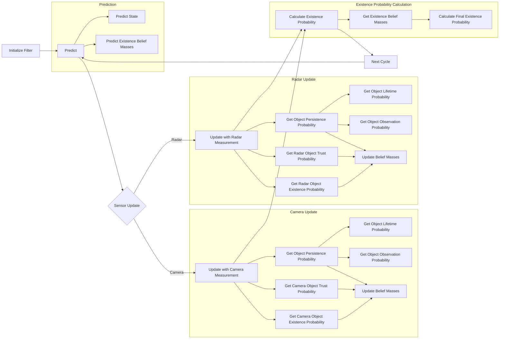

```mermaid
graph LR
    A[Initialize Filter] --> B[Predict]
    B --> C{Sensor Update}
    C -->|Camera| D[Update with Camera Measurement]
    C -->|Radar| E[Update with Radar Measurement]
    D --> F[Calculate Existence Probability]
    E --> F
    F --> G[Next Cycle]
    G --> B

    subgraph "Prediction"
    B --> B1[Predict State]
    B --> B2[Predict Existence Belief Masses]
    end

    subgraph "Camera Update"
    D --> D1[Get Camera Object Existence Probability]
    D --> D2[Get Camera Object Trust Probability]
    D --> D3[Get Object Persistence Probability]
    D3 --> D3a[Get Object Lifetime Probability]
    D3 --> D3b[Get Object Observation Probability]
    D1 & D2 & D3 --> D4[Update Belief Masses]
    end

    subgraph "Radar Update"
    E --> E1[Get Radar Object Existence Probability]
    E --> E2[Get Radar Object Trust Probability]
    E --> E3[Get Object Persistence Probability]
    E3 --> E3a[Get Object Lifetime Probability]
    E3 --> E3b[Get Object Observation Probability]
    E1 & E2 & E3 --> E4[Update Belief Masses]
    end

    subgraph "Existence Probability Calculation"
    F --> F1[Get Existence Belief Masses]
    F1 --> F2[Calculate Final Existence Probability]
    end
```
