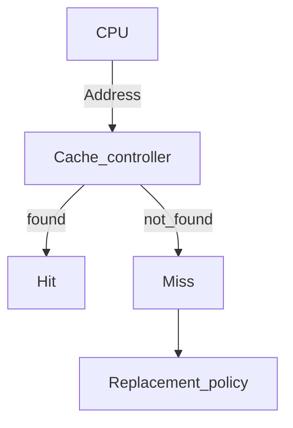

**Cache hit:** CPU requests data transfer to/from a specific memory address and the cache memory finds it. Cache is used for memory transfer and the overhead of RAM access is removed.

**Cache miss:** Cache controller cannot find the data, and adds the overhead that the processor must go through since now memory has to be accessed anyway.

**Cache replacement policy:** When a cache miss occurs for a given memory address, we have to decide whether to bring that memory into memory. The ideal cache replacement policy removes data that is infrequently used to make room for data that is hopefully frequently used.

