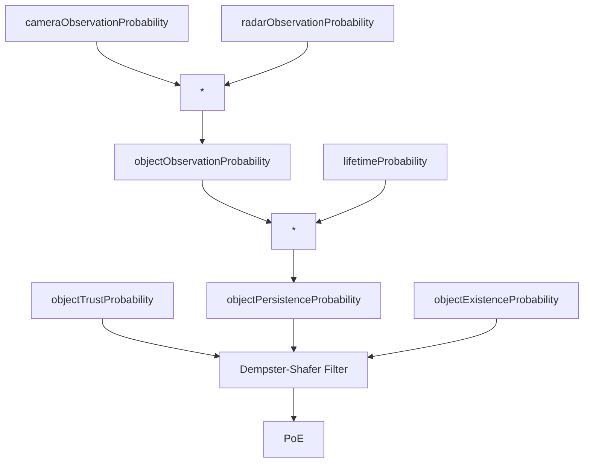

Detection probability: Probability of detecting the object with the sensor (camera/radar) in a single cycle, based on the object's predicted state and sensor parameters.

Observation probability:  measures how likely it is that we would have observed the object as often as we did, given our sensor's detection capabilities. Determines whether the frequency of observations aligns with what we would expect if the object were real.
- Uses the binomial CDF to calculate the probability of observing the object at least as many times as we actually did given our detection probability and the number of attempts.

Lifetime probability: Represents how likely the object is to continue existing based on its tracked lifetime. The longer an object has been consistently tracked, the more likely it is to be a real object rather than a transient or false detection.

