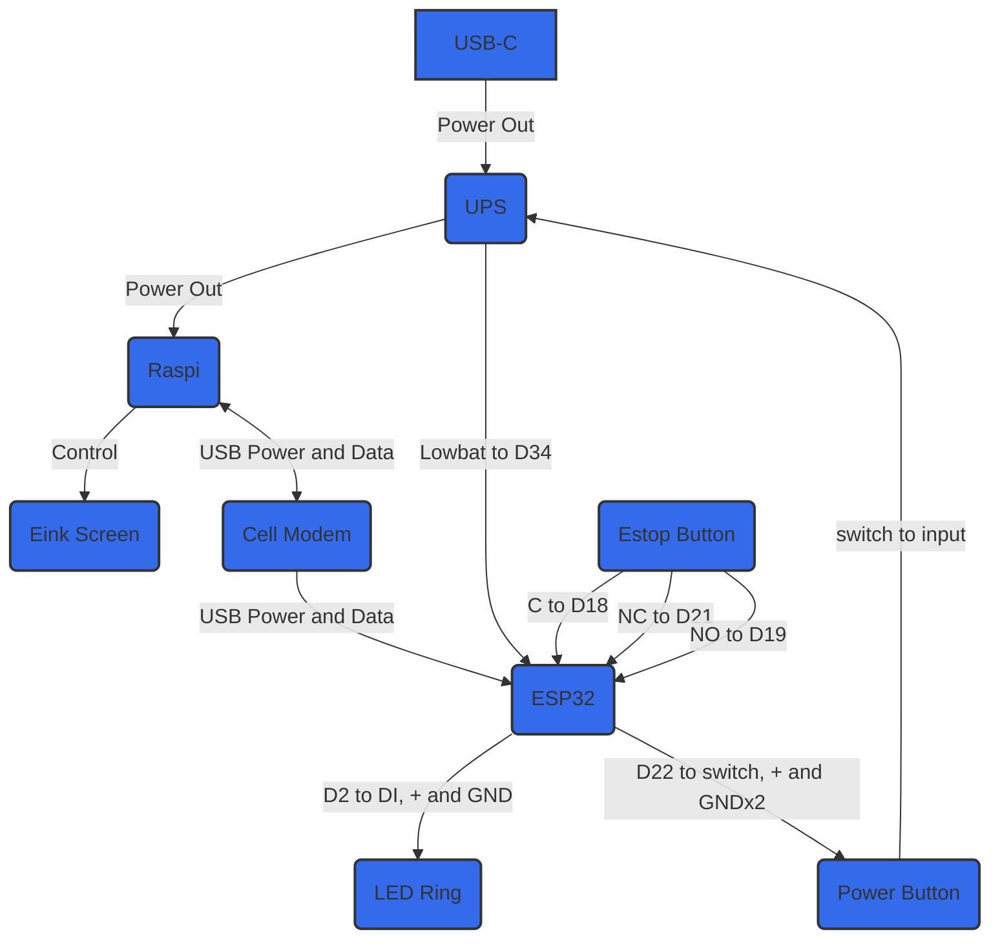

## Materials
- Raspberry Pi Zero 2 W
- ESP32
- 

## Steps

### Preliminary
1. Tape over Raspberry Pi USB connections

![[attachments/E-Stop.png|3984]]

2. Solder pins. May want to clean flux singe marks after soldering

![[attachments/E-Stop-1.png|480]]

3. Heat-sink – apply thermal pads and fasten e-stop

![[attachments/E-Stop-3.png|56]]

![[attachments/E-Stop-2.png|172]]

4. Insert to microSD card.

![[attachments/E-Stop-4.png|324]]

![[E-Stop-5.png|184]]

### Wire Soldering

Overall system diagram:

#### E-stop button to ESP32:
- E-stop C → ESP32 D18 (Blue wire)
- E-stop NO → ESP32 D19 (Yellow wire)
- E-stop NC → ESP32 D21 (White wire)
- Don't forget to put O-ring on E-stop button!

![[Polymath/attachments/E-Stop-1.png|200]]

![[Polymath/attachments/E-Stop-2.png|200]]

#### LED Ring to ESP32
- LED Ring D1 → ESP32 D2 (Green wire)
- LED Ring PWR5V → ESP32 VIN (Red wire)
- LED Ring GND → ESP32 GND (Black wire)

![[Polymath/attachments/E-Stop-3.png|200]]

![[Polymath/attachments/E-Stop-4.png|200]]

#### Start Button to ESP32 and RPi
