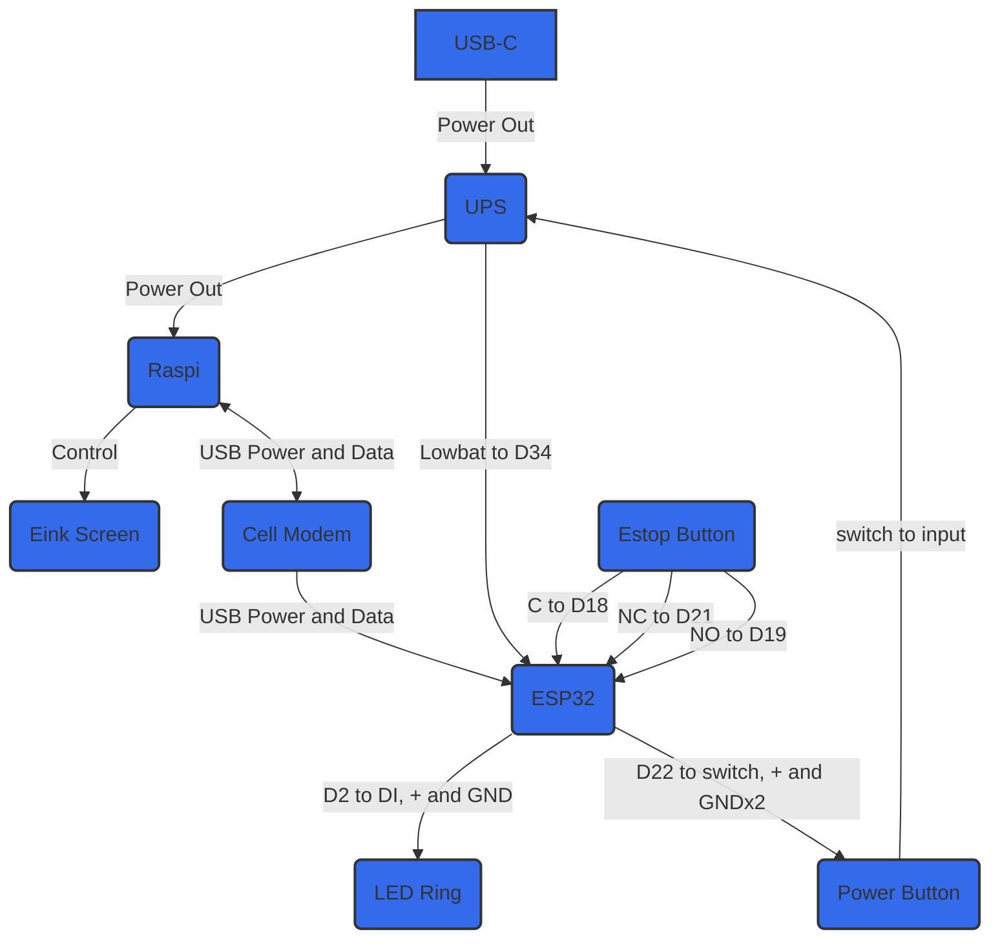

## Materials
- Raspberry Pi Zero 2 W

## Steps

1. Tape over Raspberry Pi USB connections?

![[E-Stop.png|400]]

2. Solder pins. May want to clean flux singe marks after soldering

![[E-Stop-1.png|536]]

3. Heat-sink – apply thermal pads and fasten e-stop

![[E-Stop-3.png|504]]

![[E-Stop-2.png|268]]

4. Insert to microSD card.

![[E-Stop-4.png|324]]

![[E-Stop-5.png|184]]

5. Solder

Here are pictures of the solders:

- E-stop button:
- Power Button:
- LED Ring