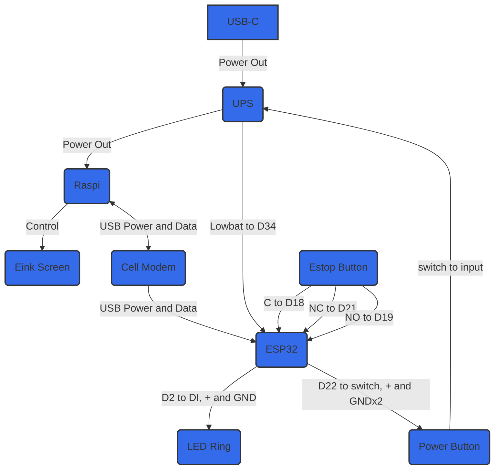

## Materials
- Raspberry Pi Zero 2 W
- ESP32

40 + 6 + 6 + 5 + 4 + 2
## Steps

### Preliminary
1. Tape over Raspberry Pi USB connections

![[E-Stop.png|3984]]

2. Solder pins. May want to clean flux singe marks after soldering

![[attachments/E-Stop-1.png|480]]

3. Heat-sink – apply thermal pads and fasten e-stop

![[attachments/E-Stop-3.png|300]]

![[attachments/E-Stop-2.png|172]]

4. Insert to microSD card.

![[attachments/E-Stop-4.png|324]]

![[E-Stop-5.png|184]]

### Wire Soldering

Overall system diagram:

```mermaid
graph TD
    USB-C -->|Power Out| UPS(UPS)
    UPS(UPS) -->|Power Out| R(Raspi)
    R -->|Control| ES(Eink Screen)
    R <-->|USB Power and Data| C(Cell Modem)
		C -->|USB Power and Data| E(ESP32)
    E -->|D2 to DI, + and GND| L(LED Ring)
    E -->|D22 to switch, + and GNDx2| PB(Power Button)
    PB -->|switch to input| UPS
    UPS -->|Lowbat to D34| E
    EB(Estop Button) -->|C to D18| E
    EB -->|NC to D21| E
    EB -->|NO to D19| E

    classDef component fill:#346beb,stroke:#333,stroke-width:2px;
    class USB-C,UPS,R,E,C,ES,L,PB,EB component;
```

#### E-stop button to ESP32:
- E-stop C → ESP32 D18 (Blue wire)
- E-stop NO → ESP32 D19 (Yellow wire)
- E-stop NC → ESP32 D21 (White wire)
- Don't forget to put O-ring on E-stop button!

![[Polymath/attachments/E-Stop-1.png|200]]

![[Polymath/attachments/E-Stop-2.png|200]]

#### LED Ring to ESP32
- LED Ring D1 → ESP32 D2 (Green wire)
- LED Ring PWR5V → ESP32 VIN (Red wire)
- LED Ring GND → ESP32 GND (Black wire)

![[Polymath/attachments/E-Stop-3.png|200]]

![[Polymath/attachments/E-Stop-4.png|200]]

#### Start Button to ESP32 and RPi

username: `polymath`
password: `polymathestop`

`polymath-estop-2`: 192.168.93.157, tailscale: 100.120.145.73

- Add state field and target field to EStopMsg – both are just strings
- look into flask webpage for configuring sender ID, heartbeat rate, timeout, target

- [x] TODO: handle shutdown gracefully on the Pi side
- [ ] Create custom image/clone SD card
- [x] Document sources
- [x] Adding instructions for start on boot
- [x] Write intro in README on what we're trying to do and what the parts are generally
- [x] Quick start on robot specifically – if we ship e-stop to someone

[https://192.168.93.87/login/](https://192.168.93.87/login/ "https://192.168.93.87/login/")
user: admin, password: admin