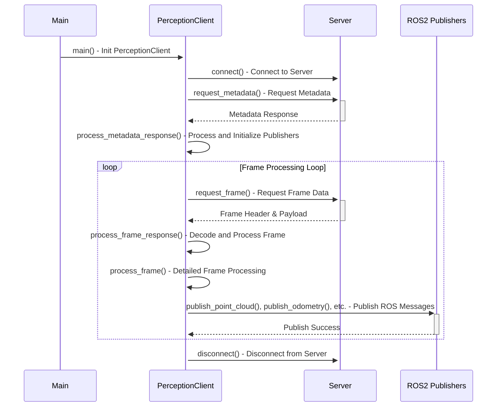

```shell
cd vidas_ros2_ws

docker run -it --name vidas -p 8765:8765 --rm -v $(pwd):/colcon_ws registry.gitlab.com/polymathrobotics/autonomy/polymath_autonomy:humble bash

cd vidas_ros2_ws
```


Lifecycle
```
ros2 lifecycle set /vidas_ros2_driver configure
ros2 lifecycle set /vidas_ros2_driver activate
ros2 lifecycle set /vidas_ros2_driver deactivate
ros2 lifecycle set /vidas_ros2_driver cleanup
```

Launch command:
```
ros2 launch vidas_ros2 vidas_ros2_launch.py
```

Questions:
- Depth image message type and visualization
- OccupancyGrid → Costmap2D
- OccupancyGrid GPS requirement?

Requires: 12V power supply – at least 12V/5A because system requires 60W during startup

TODO:
- Make faster
- Costmap2D from point cloud
- Automate putting the camera in perception mode

Criteria:
- Colorized point cloud consistency issue
- Costmap from both their cost0 frame and our costmap_2d
- Test outside

### TF
- Point clouds are published to frame `camera_0` – Line 495

PCL installation:
```
apt update
apt install libpcl-dev
apt-get install ros-${ROS_DISTRO}-pcl-msgs
```


### Feedback for Linwei's Perception Pipeline

- Is there a way to add support for 3-field $(x,y,z)$ point clouds?
```
[perception_pipeline-3] Failed to find match for field 'intensity'.
```

- Perception pipeline lifecycle seems to be written to configure and activate in `main.cpp` – not sure this is best practice, as this can be done in a launch file instead with `nav2_lifecycle_manager`
	- In my Compound Eye launch file, I have the costmap node configured to run with lifecycle manager, and perception pipeline is messing with stuff (costmap node doesn't activate, etc)

Some notes:
- Still some tuning to be done on costmaps and point cloud filters, but obstacles are showing up more or less where I would expect and the noise has been reduced by a lot
- Odom is a bit slow and finicky – you can see the camera move first and the tf takes a bit to react and sometimes moves in the wrong direction before correcting itself
- Footprint is not to scale (inherited from Troy's equipmentshare config)

