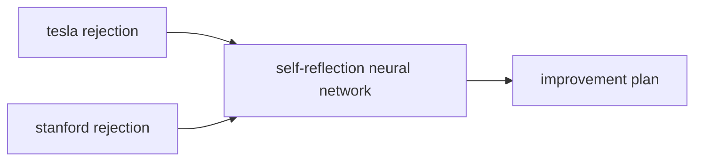

## Rejection
I got rejected from Stanford MS EE HCP today. I wasn't exactly *expecting* to get in, but I thought I had a decent shot; the only real glaring thing in my profile that I could identify was that my GPA was a little low. I guess I was under the impression that it would be fairly easy, since it seemed like a cash-cow sort of program and my employer with a direct agreement with Stanford to pay for it. They have a building with my CEO's name on it, but I guess he's just my CEO and not my dad. It also seems like things are more competitive than I thought (although the screenshots below are for CS and not EE):

![[Self-Reflection - March 30, 2026-1774926235518.webp]]

![[Self-Reflection - March 30, 2026-1774926242515.webp]]

- Source: [Results and Decisions: Stanford 2026 : r/MSCS](https://www.reddit.com/r/MSCS/comments/1s3n1c7/results_and_decisions_stanford_2026/)

Possible weaknesses in my application that I can correct in the future:
- Transcript did not include 4A which was my best term
- I think my statement of purpose was generally fine, but it could be better
- Maybe the shorter diversity supplementary essay was not good
- Over-explained why my 1B/2A grades were bad
- My publications not particularly impressive, old, and only tangentially related to my current interests (medical imaging vs. robotics).

The immediate plan as it pertains to the MS EE is take a [Robotics and Autonomous Systems Graduate Certificate](https://online.stanford.edu/programs/robotics-and-autonomous-systems-graduate-certificate) and re-apply to the Masters later. This seems to be what this [Steven Feng](https://www.linkedin.com/feed/update/urn:li:activity:7444412988318650368/?originTrackingId=tZxBkGLZc1pADqFYSg7kBA%3D%3D) did. I will try to analyze him as a case study since he also graduated from UW Tron and is also working at NVIDIA, so he is an example I can learn from.
- Interestingly, Steven's undergrad GPA (85.04) and Stanford NDO GPA (3.7) are not very high, especially compared to the first Reddit commenter above.
- Some possible reasons he got in and these Redditors didn't:
    - According to his LinkedIn post, he seems to have gotten a lot of reviews on his application from people.
    - He continued to do research after graduating: graduated in 2023 but published a RAL paper with Yue Hu in 2025.
    - He has a lot of publicized work on his [portfolio](https://stevenf7.github.io/?lang=en). (To be honest, I don't think this is particularly impressive work in terms of technical content).

## Reflection
Obviously I'm disappointed with this result. It adds salt to the wound after I got rejected by Tesla in October. There's no feedback from Stanford on my application, so I will also reflect on Tesla as proxy for added signal, like adding an additional input to neural network.

### Being mean to myself >:(
Generally it is evident that I am skill-issued. There is no reason that I should be failing that Tesla interview. I did not have a lot of time to prepare, but that is not a good excuse; the questions asked were generally fairly foundational skills that I should be able to do: numpy, PyTorch. Failing the precision-recall question was especially embarrassing. In general, I think my knowledge of ML/DL is not quite up to par with SOTA at a level where I'm satisfied. But the gap should be smaller than I think: I just need to put the work in.

I think the Stanford thing is less glaringly stupid compared to Tesla. There is definitely room for improvement but I didn't do anything wrong per se as far as I can think.
### Some cope to make myself feel better :)
- Still did well enough at Tesla that they've reached out to interview for other positions twice since then.
- I passed the intern/phone screen rounds. If I had been interviewing for an internship I definitely would've gotten it, even if I had done those interviews a year ago. Thus, it's just a bit unlucky that I got the interview during new grad cycle and not intern.
- I still have a decent job and life! This is nowhere close to being the end of the world.
### Do I really need a Masters?
Not really. 
- The main reason to get one is that I like learning, and having some structure to it would be nice. 
- Furthermore, the additional credential and skills would open up more opportunities. I think my current job is interesting enough, but I do think I would likely get bored of it eventually. I also worry that if everyone just shifts to large multimodal end-to-end NNs, fusion will become somewhat obsolete. Even if this is not true (OpenAI is hiring for SLAM…SLAM is not dead!), having more doors open is never a bad thing.
- There are also some implicit benefits like facility access, community, etc. 

Thus, for now we will continue on the path of aiming for a Stanford MS HCP, but just remember that this should not be a North Star. It's a benefit and a means to an end. If I get a really interesting research job for example, there's no real reason to do a Masters.

## Plan
I am skill-issued and also got rejected from my Masters. What should I do moving forward?

### Never get skill issued again.
Obviously this will be hard to do and will take time and effort. 

First, I think it is important to strengthen my skills in foundational math. My weak understanding of math makes it exponentially harder to get through content on deep learning, because I have to sit and think through every equation or ask GPT to explain it to me. A lot of these things should probably be more immediately obvious. To improve in this aspect, I will work on Math Academy and get through their Math for Machine Learning course. Then, it might be wise to go through some math books like *All of Statistics* or *LADR*, etc. However, I think it would be hard to stay motivated doing just pure math, so I should do other more interesting things on the side so that there's some light at the end of the tunnel, even if it may lower efficiency a little. Low efficiency is better than getting stuck and getting nothing done.

Second, my skills in deep learning, which I think is my main area of interest, are too weak. This is being partially rectified by AMATH 449, but it's nowhere near enough. Thus, I will finish *UDL* and do all the exercises. Another nice resource might be *DLFC*, which has a ton of math-heavy exercises, so this could potentially be nice for getting better at math and deep learning (which I guess is just applied math) at the same time.

All this bricklaying will take a while. After this, maybe we can look at other areas of interest that I'd like to know more about, like RL and SLAM. Books in particular: *Mathematical Foundations of Reinforcement Learning*, *SLAM Handbook*.

The Stanford certificate can directly help in this aspect.

### Work, Projects/Research
I think all of this is fairly obvious but I will write it down.

At work, I should try and take on scope and make big impacts to move up the ladder. This will give me exposure to more things and give me more opportunity to jump around and try different things.

I should work on cool projects and research. I honestly think my personal projects are quite weak. I often leave them half-finished and just don't invest all that much time in the first place. I want my projects to be more research-y; maybe a good idea that will interweave well with my learning is to start blogging in the style of [Lil'Log](https://lilianweng.github.io/), or try to build things. Even [negative results](https://www.rajan.sh/multiplayer) would be good to talk about. Working on publicizing more would likely be beneficial as we've seen with Steven Feng and successful people in general. (Although I guess there's some sampling bias here, because I only know success people with publicized work due to their work being public). I can immediately start doing this.

Another possible route, although this is a bit less appealing to my personal tastes, is to work on open-source non-research software in the style of Weng Jiayi and tianshou; maybe this could be roamr?

An appealing, but definitely difficult route is independent research. I think it has to be independent or as part of an open-source effort to not piss off my employer. It's definitely possible; for example, [Ezgi Korkmaz](https://ezgikorkmaz.github.io/) has done a lot of great solo work. To do this, the way forward would be to work on foundational learning theory type things like Ezgi, or interpretability. I think these areas require relatively little compute and external support. It's definitely not going to be easy though. This path is very appealing to me in terms of outcomes but it will be a long road. It will require a ton of the math and deep learning groundwork to be done first.

### Metacognition
Outside of the concrete things I want to learn, I should also put some thought into general ways I could improve as a learner (and maybe just as a person).

1. I think my learning style is not as efficient as it could be. Right now, I like to take a lot of verbose notes. I think this is fairly effective in terms of learning but takes a significant amount of time. I should try to iterate on my learning process and try to improve it. Maybe just reading, shorter notes (or even no notes), tons and tons of exercises and implementation?
2. I need to be very picky about when and when not to use AI. It should always be a learning aide, not a replacement. ASI has not arrived and so I should not give up on my brain yet.
3. I am a fairly high-efficiency worker, but I could make improvements to my working stamina and consistency. I can get side-tracked sometimes or try to multi-task, such that I feel busy but did not actually achieve anything. 
4. Especially when learning something such as math, I need to practice being okay with things taking a long time.

## Immediate Concrete Plan
1. Finish 4B, keeping my average as high as I can.
2. Over the summer, travel to relax. Despite my sense of urgency to grind, I should appreciate this time as it will be hard to get a break like this again.
3. When not traveling: Do MathAcademy, along with UDL.
4. Apply for Stanford NDO certificate – this may have to done once I start working but I could give it an attempt now.