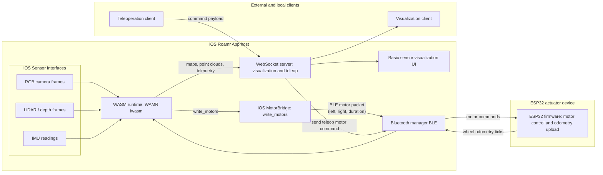
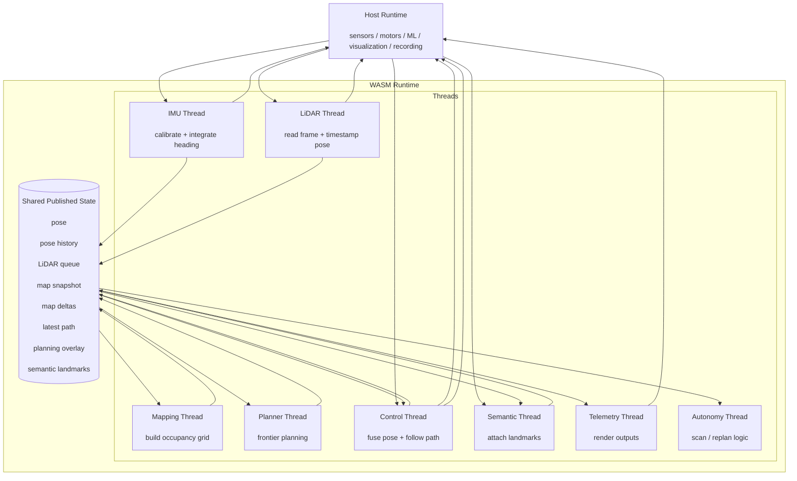
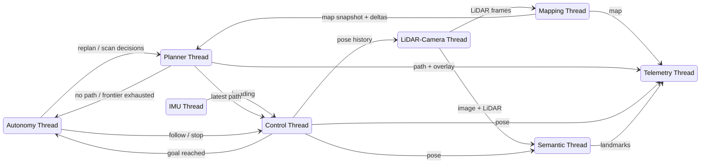

Todo:
- [ ] Wheel encoders

Path following:
- [ ] Wheel odom: Estimate pose $(x, y, \theta)$ from encoder ticks
    - [ ] IMU for heading?
- [ ] Compute wheel speeds from odom deltas
- [ ] Inner loop: Wheel speed → motor percents
- [ ] Convert twist $(v, \omega)$ to desired wheel speeds
- [ ] Outer loop: Desired target point → twist message
- [ ] Rerun path visualization

Currently we have a way to allow users to access to camera sensors and write to motors by writing code in C++ and then compiling to WASM and running WASM (see slam_main.cpp for an example) without writing Swift or re-building the app. I want to extend this to ExecuTorch models so that we can do something like: Pass image from camera into model -> if model detects stop sign -> send 0 0 0 to motors. I'm ok with doing the model stuff in Python and C++, but still no Swift/app rebuilding. What's the cleanest way to implement this?

Architecture diagram:


WASM architecture:


Autonomy logic:



```
.venv/bin/python executorch_export.py \
  --torchvision-model ssdlite320_mobilenet_v3_large \
  --torchvision-weights default \
  --image-size 320 \
  --backend coreml \
  --output-dir ../stop_sign_bundle_coreml
```

Docker container
```bash
docker run -it --name roamr --rm -v $(pwd):/colcon_ws osrf/ros:humble-desktop bash
```

```
alias oops='rm -rf build install log'
```


```
Control characteristic discovered

Initializing WAMR runtime...

Set session preset to inputPriority

Set format: video 1280x720, depth 320x180, type=1717855600

Running WASM module from: UIDZbg97kGoebkABg9gS_slam_main.wasm

Rerun websocket connecting to: ws://100.117.178.92:9877

[BLE TX] send msg="0 0 0" bytes=5 type=withoutResponse char=FF01 props=0x4

[BLE TX] queued msg="0 0 0"

Sensor config

T: 0, height: 1280, width: 720, channels: 3

[BLE TX] send msg="20 -20 3000" bytes=11 type=withoutResponse char=FF01 props=0x4

[BLE TX] queued msg="20 -20 3000"

Control characteristic discovered

Data characteristic discovered

Status characteristic discovered

Notifications enabled for FF02

[BLE ODOM RX] notify bytes=7

[BLE ODOM RX] frame seq=0 n=1 dt_ms=20 first=(2432,2545) queued=1

[BLE TX] send msg="START 900 20" bytes=12 type=withoutResponse char=FF01 props=0x4

[BLE TX] queued msg="START 900 20"

[BLE ODOM RX] notify bytes=7

[BLE ODOM RX] frame seq=1 n=1 dt_ms=20 first=(2377,2506) queued=1

[BLE ODOM RX] notify bytes=15

[BLE ODOM RX] frame seq=2 n=3 dt_ms=20 first=(2494,2685) queued=3

[BLE ODOM RX] notify bytes=15

[BLE ODOM RX] frame seq=3 n=3 dt_ms=20 first=(2399,2546) queued=3

[BLE ODOM RX] notify bytes=15

[BLE ODOM RX] frame seq=4 n=3 dt_ms=20 first=(2409,2538) queued=3

[BLE ODOM RX] notify bytes=15

[BLE ODOM RX] frame seq=5 n=3 dt_ms=20 first=(2433,2536) queued=3

[BLE ODOM RX] notify bytes=15

[BLE ODOM RX] frame seq=6 n=3 dt_ms=20 first=(2440,2547) queued=3

[BLE ODOM RX] notify bytes=15

[BLE ODOM RX] frame seq=7 n=3 dt_ms=20 first=(2393,2557) queued=3

[BLE ODOM RX] notify bytes=15

[BLE ODOM RX] frame seq=8 n=3 dt_ms=20 first=(2428,2545) queued=3

[BLE ODOM RX] notify bytes=15

[BLE ODOM RX] frame seq=9 n=3 dt_ms=20 first=(2349,2584) queued=3

[BLE ODOM RX] notify bytes=15

[BLE ODOM RX] frame seq=10 n=3 dt_ms=20 first=(2405,2576) queued=3

[BLE ODOM RX] notify bytes=15

[BLE ODOM RX] frame seq=11 n=3 dt_ms=20 first=(2357,2583) queued=3

[BLE ODOM RX] notify bytes=15

[BLE ODOM RX] frame seq=12 n=3 dt_ms=20 first=(2410,2572) queued=3

[BLE ODOM RX] notify bytes=15

[BLE ODOM RX] frame seq=13 n=3 dt_ms=20 first=(2428,2602) queued=3

[BLE ODOM RX] notify bytes=15

[BLE ODOM RX] frame seq=14 n=3 dt_ms=20 first=(2430,2594) queued=3

initialized g: 9.80235, -0.229499, -0.178045

calibrated IMU

[BLE ODOM RX] notify bytes=23

[BLE ODOM RX] frame seq=15 n=5 dt_ms=20 first=(2448,2579) queued=5

[BLE ODOM RX] notify bytes=15

[BLE ODOM RX] frame seq=16 n=3 dt_ms=20 first=(2402,2541) queued=3

[BLE ODOM RX] notify bytes=15

[BLE ODOM RX] frame seq=17 n=3 dt_ms=20 first=(2384,2550) queued=3

[BLE ODOM RX] notify bytes=15

[BLE ODOM RX] frame seq=18 n=3 dt_ms=20 first=(2422,2536) queued=3

[BLE ODOM RX] notify bytes=15

[BLE ODOM RX] frame seq=19 n=3 dt_ms=20 first=(2443,2569) queued=3

[BLE ODOM RX] notify bytes=15

[BLE ODOM RX] frame seq=20 n=3 dt_ms=20 first=(2381,2562) queued=3

IMU yaw deg: 0 | yaw_x/y/z=0/90/0 | fwd=[1,0,0] | horiz=1 | up=[0,0,1]

rerun_log_lidar_frame_impl: image_size is 0 in WASM payload; skipping camera/image logging

[BLE TX] send msg="START 900 20" bytes=12 type=withoutResponse char=FF01 props=0x4

[BLE TX] queued msg="START 900 20"

[BLE ODOM RX] notify bytes=15

[BLE ODOM RX] frame seq=21 n=3 dt_ms=20 first=(2417,2574) queued=3

[BLE ODOM RX] notify bytes=15

[BLE ODOM RX] frame seq=22 n=3 dt_ms=20 first=(2334,2562) queued=3

[BLE ODOM RX] notify bytes=15

[BLE ODOM RX] frame seq=23 n=3 dt_ms=20 first=(2383,2588) queued=3

[BLE ODOM RX] notify bytes=15

[BLE ODOM RX] frame seq=24 n=3 dt_ms=20 first=(2357,2581) queued=3

[BLE ODOM RX] notify bytes=15

[BLE ODOM RX] frame seq=25 n=3 dt_ms=20 first=(2398,2574) queued=3

[BLE ODOM RX] notify bytes=15

[BLE ODOM RX] frame seq=26 n=3 dt_ms=20 first=(2405,2566) queued=3

[BLE ODOM RX] notify bytes=15

[BLE ODOM RX] frame seq=27 n=3 dt_ms=20 first=(2417,2559) queued=3

[BLE ODOM RX] notify bytes=15

[BLE ODOM RX] frame seq=28 n=3 dt_ms=20 first=(2425,2538) queued=3

[BLE ODOM RX] notify bytes=15

[BLE ODOM RX] frame seq=29 n=3 dt_ms=20 first=(2367,2548) queued=3

[BLE ODOM RX] notify bytes=15

[BLE ODOM RX] frame seq=30 n=3 dt_ms=20 first=(2412,2539) queued=3

[BLE ODOM RX] notify bytes=15

[BLE ODOM RX] frame seq=31 n=3 dt_ms=20 first=(2321,2526) queued=3

calibrated IMU

[BLE ODOM RX] notify bytes=15

[BLE ODOM RX] frame seq=32 n=3 dt_ms=20 first=(2394,2535) queued=3

[BLE ODOM RX] notify bytes=19

[BLE ODOM RX] frame seq=33 n=4 dt_ms=20 first=(2378,2545) queued=4

[BLE ODOM RX] notify bytes=15

[BLE ODOM RX] frame seq=34 n=3 dt_ms=20 first=(2413,2563) queued=3

[BLE ODOM RX] notify bytes=15

[BLE ODOM RX] frame seq=35 n=3 dt_ms=20 first=(2368,2557) queued=3

[BLE ODOM RX] notify bytes=15

[BLE ODOM RX] frame seq=36 n=3 dt_ms=20 first=(2414,2535) queued=3

[BLE ODOM RX] notify bytes=15

[BLE ODOM RX] frame seq=37 n=3 dt_ms=20 first=(2435,2547) queued=3

IMU yaw deg: 0.00607406 | yaw_x/y/z=0.00607406/90.0061/-103.428 | fwd=[1,0.000106012,9.10545e-05] | horiz=1 | up=[-9.10141e-05,-0.000381223,1]

[BLE ODOM RX] notify bytes=15

[BLE ODOM RX] frame seq=38 n=3 dt_ms=20 first=(2426,2557) queued=3

[BLE ODOM RX] notify bytes=23

[BLE ODOM RX] frame seq=39 n=5 dt_ms=20 first=(2445,2531) queued=5

[BLE ODOM RX] notify bytes=15

[BLE ODOM RX] frame seq=40 n=3 dt_ms=20 first=(2413,2577) queued=3

[BLE TX] send msg="START 900 20" bytes=12 type=withoutResponse char=FF01 props=0x4

[BLE TX] queued msg="START 900 20"

[BLE ODOM RX] notify bytes=15

[BLE ODOM RX] frame seq=41 n=3 dt_ms=20 first=(2391,2582) queued=3

[BLE ODOM RX] notify bytes=15

[BLE ODOM RX] frame seq=42 n=3 dt_ms=20 first=(2415,2546) queued=3

[BLE ODOM RX] notify bytes=15

[BLE ODOM RX] frame seq=43 n=3 dt_ms=20 first=(2442,2562) queued=3

[BLE ODOM RX] notify bytes=15

[BLE ODOM RX] frame seq=44 n=3 dt_ms=20 first=(2389,2546) queued=3

[BLE ODOM RX] notify bytes=15

[BLE ODOM RX] frame seq=45 n=3 dt_ms=20 first=(2408,2530) queued=3

[BLE ODOM RX] notify bytes=15

[BLE ODOM RX] frame seq=46 n=3 dt_ms=20 first=(2336,2524) queued=3

calibrated IMU

[BLE ODOM RX] notify bytes=15

[BLE ODOM RX] frame seq=47 n=3 dt_ms=20 first=(2386,2534) queued=3

[BLE TX] send msg="0 0 0" bytes=5 type=withoutResponse char=FF01 props=0x4

[BLE TX] queued msg="0 0 0"

[BLE TX] send msg="10 -10 3000" bytes=11 type=withoutResponse char=FF01 props=0x4

[BLE TX] queued msg="10 -10 3000"

[BLE ODOM RX] notify bytes=15

[BLE ODOM RX] frame seq=48 n=3 dt_ms=20 first=(2350,2551) queued=3

[BLE ODOM RX] notify bytes=15

[BLE ODOM RX] frame seq=49 n=3 dt_ms=20 first=(426,441) queued=3

[BLE ODOM RX] notify bytes=19

[BLE ODOM RX] frame seq=50 n=4 dt_ms=20 first=(-18,55) queued=4

[BLE ODOM RX] notify bytes=15

[BLE ODOM RX] frame seq=51 n=3 dt_ms=20 first=(1,-2) queued=3

[BLE ODOM RX] notify bytes=15

[BLE ODOM RX] frame seq=52 n=3 dt_ms=20 first=(1,1) queued=3

[BLE ODOM RX] notify bytes=15

[BLE ODOM RX] frame seq=53 n=3 dt_ms=20 first=(5,1) queued=3

[BLE ODOM RX] notify bytes=15

[BLE ODOM RX] frame seq=54 n=3 dt_ms=20 first=(-1,-1) queued=3

IMU yaw deg: 0.000711224 | yaw_x/y/z=0.000711224/90.0007/-137.584 | fwd=[1,1.24132e-05,0.000378409] | horiz=1 | up=[-0.000378405,-0.000345727,1]

[BLE ODOM RX] notify bytes=15

[BLE ODOM RX] frame seq=55 n=3 dt_ms=20 first=(-1,1) queued=3

[BLE ODOM RX] notify bytes=15

[BLE ODOM RX] frame seq=56 n=3 dt_ms=20 first=(-3,0) queued=3

[BLE ODOM RX] notify bytes=15

[BLE ODOM RX] frame seq=57 n=3 dt_ms=20 first=(-1,-1) queued=3

[BLE ODOM RX] notify bytes=23

[BLE ODOM RX] frame seq=58 n=5 dt_ms=20 first=(1,-3) queued=5

[BLE ODOM RX] notify bytes=15

[BLE ODOM RX] frame seq=59 n=3 dt_ms=20 first=(2,-1) queued=3

[BLE ODOM RX] notify bytes=15

[BLE ODOM RX] frame seq=60 n=3 dt_ms=20 first=(3,1) queued=3

[BLE ODOM RX] notify bytes=15

[BLE ODOM RX] frame seq=61 n=3 dt_ms=20 first=(1,3) queued=3

[BLE TX] send msg="START 900 20" bytes=12 type=withoutResponse char=FF01 props=0x4

[BLE TX] queued msg="START 900 20"

[BLE ODOM RX] notify bytes=15

[BLE ODOM RX] frame seq=62 n=3 dt_ms=20 first=(-1,1) queued=3

calibrated IMU
```